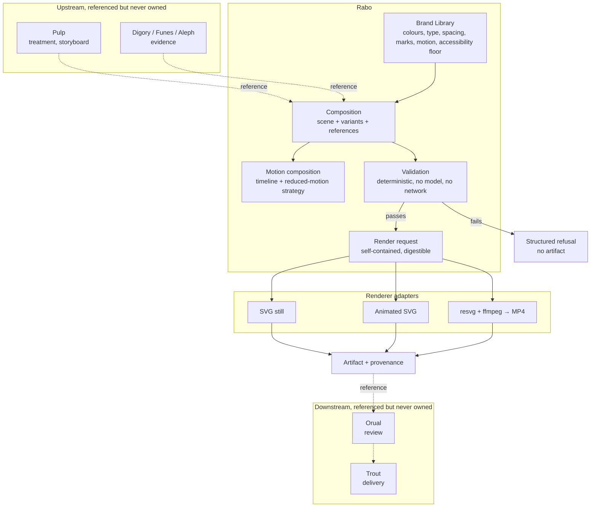

# Rabo

> **License:** Copyright © 2026 Sifrious. All rights reserved. This is
> publicly viewable proprietary software, not open-source software. See
> [LICENSE.md](LICENSE.md).

Rabo owns portable brand libraries, editable static and motion compositions, provider-neutral
render requests, and deterministic visual validation.

A composition is a document, not a picture. It names what it says, which brand it says it in,
what evidence stands behind it, and how it moves — and it can be handed to another process,
validated without a database, and rendered into a file whose provenance traces all the way
back. Rendered artifacts are outputs. The composition stays canonical and editable.

Rabo does not own what claim should be made or to whom (Pulp), where the underlying material
came from (Digory, Funes, Aleph), whether the work is editorially acceptable (Orual), where it
is published (Trout), or the application chrome and product-interface design system that
Burdgeon owns. It holds opaque references to those things and resolves none of them.

## Verification

```sh
composer install
composer test
```

That runs 87 fixtures covering brand round-tripping, content-addressed asset identity,
composition and variant derivation, deterministic rendering, every validation code, timeline
ordering and reduced-motion derivation, provenance, and the CLI. See
[docs/human-verification.md](docs/human-verification.md) for the commands to run by hand and
what each should print.

The same suite runs in CI on every push and pull request, across PHP 8.3 and 8.4, on a runner with
neither `resvg` nor `ffmpeg` installed — which also proves the MP4 adapter refuses deterministically
rather than crashing when its tools are absent.

## The first proof

One evidence-linked composition, `agent completion ≠ verified completion`, rendered four ways
from a single source scene:

```sh
php bin/rabo validate fixtures/agent-completion-verified-completion
php bin/rabo render  fixtures/agent-completion-verified-completion --format=svg
php bin/rabo render  fixtures/agent-completion-verified-completion --format=svg --scene=square
php bin/rabo render  fixtures/agent-completion-verified-completion --format=svg-animated
php bin/rabo render  fixtures/agent-completion-verified-completion --format=svg-animated --reduced-motion
php bin/rabo inspect build/static.svg
```

Open `build/motion.svg` in a browser for the fifteen seconds; `build/reduced-motion.svg` is
the same piece with the motion removed. `diff -r build fixtures/agent-completion-verified-completion/expected`
reports nothing: the committed artifacts are exactly what these commands regenerate.

## How it fits together



## Core model

| Concept | What it is |
| --- | --- |
| **Brand Library** | The portable source of truth for a visual identity: colour tokens and semantic roles, type roles and font metrics, spacing, radii, strokes, marks with their treatment rules, motion tokens, and the accessibility floor. Versioned, and compatible-renderer aware. |
| **Composition** | An envelope: a canonical scene, the variants derived from it, the brand version it is pinned to, and the cross-package references that explain why it exists. |
| **Scene** | A tree of primitives — `stack`, `text`, `shape`, `image` — plus connectors between them, an authored reading order, and a description. |
| **Variant** | A derived output shape. Names a new canvas and the smallest set of overrides (which stacks change axis, how they align) needed to read well there. It never replaces its source. |
| **Motion composition** | A timeline of cues over an existing scene, plus a mandatory reduced-motion strategy. Not a video attached to a picture. |
| **Asset** | Bytes addressed by their own sha256 digest, carrying rights, dimensions, and derivation. |
| **Render request** | Composition plus brand plus scene plus target, self-contained enough to cross a process boundary, with a digest that identifies it. |
| **Render outcome** | Succeeded, refused, failed transiently, or acknowledged — four states a caller must treat differently. |

### Brand Library format

`fixtures/agent-completion-verified-completion/brand.json` is the canonical sample. Colours are
canonically sRGB hex so contrast arithmetic is exact and renderer-independent; an authoring-space
`display` string may ride along for round-tripping to design tools, and Rabo never computes with
it. Font families declare average advance-width ratios per weight — Rabo has no font engine, and
this is how it estimates whether text fits. Marks reference their bytes by digest and carry
minimum width and clearspace.

### Composition model

Styles reference brand tokens and never literal values, which is what lets one composition be
re-branded without editing it and lets validation prove a composition uses nothing the brand
does not declare. Layout is a pure function of scene and brand. Connectors name their endpoints
by node identifier and resolve after layout, so an arrow that points right in the landscape
composition points down in the square one without being re-authored.

### Asset identity

An asset is identified by the digest of its bytes, never by a path. The store lays files out at
`assets/sha256/<first two>/<rest>`, so `shasum -a 256` on any file returns its own address.
Identical bytes are the same asset; a derived variant has different bytes, therefore a different
identity, and records what it came from. Reading verifies the digest, so bytes altered underneath
the store are reported as corruption rather than served.

### Renderer boundary

`Renderer` declares capabilities and returns one of four outcomes. Rabo does not know whether an
implementation writes SVG, drives a browser, shells out to an encoder, or calls a hosted model.
Three adapters ship: a deterministic still renderer, a deterministic animated-SVG renderer, and
an MP4 adapter over `resvg` and `ffmpeg`. SVG is a renderer, not the domain model.

### Validation

Deterministic and local: no model, no network, no clock. Structured `ValidationIssue` values
carry a machine code, the exact path at fault, a message, and a remediation hint. Consumers match
on codes, never on prose. `fixtures/failing/` holds one small bundle per dimension, each built to
break exactly one rule.

### Motion

Cues are timed changes to nodes in the scene that already exists, so the moving version and the
still version cannot say different things. Ordering is derived from time, not authoring order.
A reduced-motion alternative is mandatory and derived from the same timeline, so it cannot be
forgotten and cannot drift. Essential content must still be visible when the timeline ends.

### Provenance

Every render result records the composition id, version and content key; the brand id, version
and key; every asset digest; the renderer identity and version; the request digest; the output
digest; and the upstream references. `rabo inspect` re-hashes an artifact and checks it against
what its provenance claims.

Determinism is enforced, not hoped for: fixed key order in serialization, integer geometry,
locale-independent number formatting, an injectable clock, and no timestamps inside artifacts.
The one exception is stated rather than hidden — MP4 bytes vary across encoder builds, so the
`ffmpeg` adapter reports `deterministic: false` and the byte-identity guarantee stays with the
animated SVG and the sampled frame SVGs.

## Example

```php
use Sifrious\Rabo\Portable\CompositionBundle;
use Sifrious\Rabo\Render\{RenderFormat, RenderRequest, RenderTarget};
use Sifrious\Rabo\Renderer\Svg\SvgStaticRenderer;
use Sifrious\Rabo\Validation\CompositionValidator;

$bundle = CompositionBundle::load('fixtures/agent-completion-verified-completion');

$report = (new CompositionValidator())->validate($bundle->composition, $bundle->brand, $bundle->assets);
if (! $report->passed()) {
    foreach ($report->errors() as $issue) {
        echo "{$issue->code->value} at {$issue->path}: {$issue->message}\n";
    }
    exit(1);
}

$outcome = (new SvgStaticRenderer($bundle->assets))->render(new RenderRequest(
    $bundle->composition,
    $bundle->brand,
    'source',
    new RenderTarget(RenderFormat::Svg, $bundle->composition->scene->canvas),
));

if ($outcome->isSuccess()) {
    file_put_contents('out.svg', $outcome->artifactOrFail()->bytes);
    echo $outcome->provenance?->outputDigest, "\n";
}
```

## Integration boundaries

Rabo depends on `php` and `sifrious/reference-contract`. It has no framework, no ORM, no HTTP
client, and no provider SDK, and it must keep none.

Consumers reach Rabo through its public contracts. A consumer may build a composition, validate
it, ask for a render, and store the returned references — the Content Engine's `VisualAsset` does
exactly this, filling `raboIdentity`, `aspectRatios`, `reducedMotionAlternative` and `rightsState`
from a bundle it never opens by hand. A consumer may not reimplement a brand rule, hold a scene's
canonical state, or decide what Rabo already decides.

`resvg` and `ffmpeg` are optional. Without them the MP4 adapter reports no capability and refuses
deterministically; everything else works unchanged.

```sh
brew install ffmpeg resvg     # optional, for --format=mp4
php bin/rabo render fixtures/agent-completion-verified-completion --format=mp4
```
